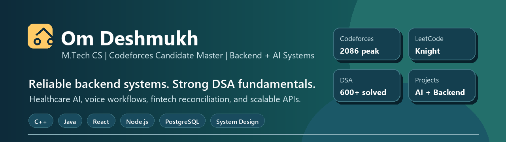
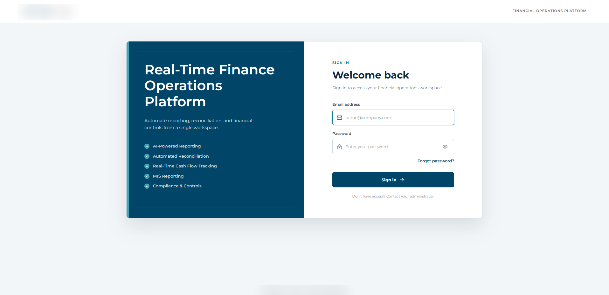
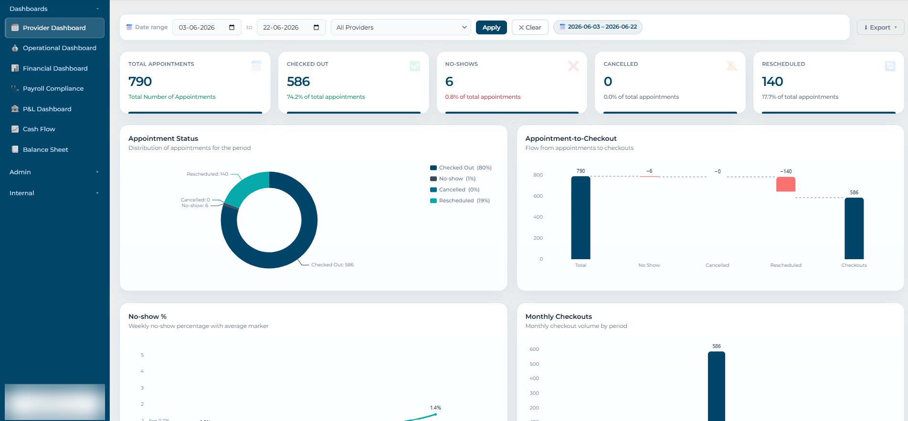
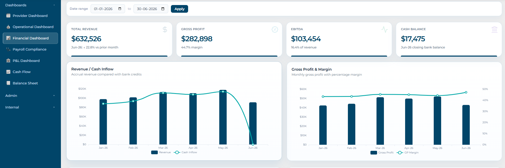
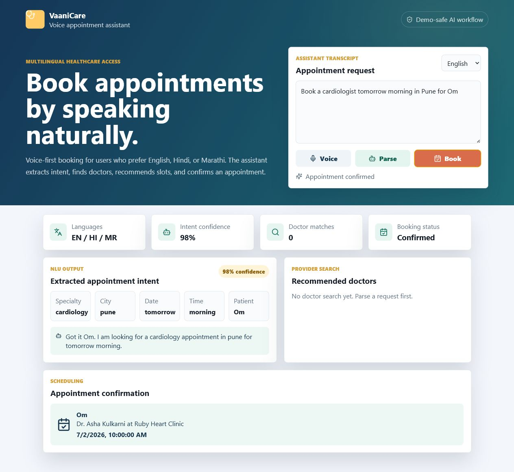

  

## About

I am an M.Tech Computer Science student from Pune focused on backend engineering, AI-assisted products, and systems that are clean enough to scale.

My strongest signal is problem solving: Codeforces Candidate Master with a peak rating of 2086, LeetCode Knight, and 600+ DSA problems across graphs, dynamic programming, trees, greedy techniques, and implementation-heavy contests.

I like building products where algorithms, APIs, data models, and user experience meet: healthcare records, voice appointment workflows, fintech reconciliation, automation, and developer tools.

## Current Focus

- Building backend systems with Node.js, Express, FastAPI, PostgreSQL, Redis, and AWS basics
- Designing AI-assisted workflows with NLU, OCR/NLP, voice interfaces, and human-in-the-loop safety
- Practicing DSA and competitive programming in C++ and Java
- Learning system design through projects with idempotency, scheduling, RBAC, audit logs, and integration boundaries

## Sanitized FinOps Platform Work

Branding and client identifiers are intentionally blurred. These previews show the kind of financial operations workflows I have worked on: reporting, reconciliation, provider operations, financial dashboards, and cash-flow visibility.

| Access flow | Provider operations | Financial dashboard |
| --- | --- | --- |
|  |  |  |

## Featured Projects

### MediBridge - Health Record Management System

Health record platform with patient timelines, RBAC, OCR/NLP report analysis, multilingual summaries, and demo ABDM / 108 Ambulance workflow adapters.

**Tech:** React, Node.js, Express, PostgreSQL schema, JWT, OCR/NLP prototype, healthcare workflows  
**Repo:** [github.com/OmDeshmukh04/MediBridge](https://github.com/OmDeshmukh04/MediBridge)

### VoiceReserve-AI - Multilingual Voice Appointment Assistant

Voice-assisted healthcare appointment booking with multilingual intent extraction, doctor matching, slot recommendation, idempotent booking, and microservice-ready NLU and scheduling boundaries.

**Tech:** React, Node.js, Express, NLU prototype, scheduling logic, Web Speech API hook  
**Repo:** [github.com/OmDeshmukh04/VoiceReserve-AI](https://github.com/OmDeshmukh04/VoiceReserve-AI)

### PowerconReconciliation - Fintech Reconciliation Workflows

Multi-provider reconciliation workflow for financial data processing, matching, and operational review.

**Tech:** TypeScript, backend workflows, reconciliation logic, provider data handling  
**Repo:** [github.com/OmDeshmukh04/PowerconReconciliation](https://github.com/OmDeshmukh04/PowerconReconciliation)

## Competitive Programming

- Codeforces Candidate Master - peak rating 2086
- Rank 3 / 31,000+ in Educational Round 178
- Rank 11 in Codeforces Round 1033 Div. 2
- LeetCode Knight with 600+ DSA problems solved

## Tech Stack

## Links

[GitHub](https://github.com/OmDeshmukh04) |
[LinkedIn](https://linkedin.com/in/om-deshmukh-298165236) |
[Codeforces](https://codeforces.com/profile/omdeshmukh1906) |
[LeetCode](https://leetcode.com/u/ExpertD19)
